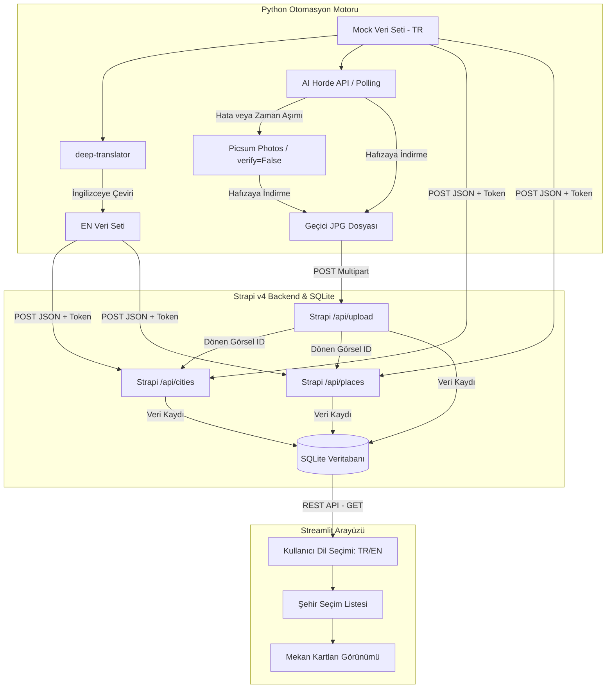

# 🌍 YZ Destekli Gezi Rehberi (AI-Powered Travel Guide)

Bu proje; yapay zekâ destekli görsellerle donatılmış, otomatik dil çevirisi (TR/EN) yapan ve modern bir kullanıcı arayüzü (Streamlit) üzerinden sunulan dinamik bir seyahat rehberi platformudur. Proje; **Strapi v4 (Backend)**, **Python Otomasyon Motoru** ve **Streamlit (Frontend)** olmak üzere üç ana katmandan oluşmaktadır.

---

## 🏗️ Sistem Mimarisi ve Veri Akışı

Aşağıdaki diyagramda verilerin otomasyon motoru ile zenginleştirilip veritabanına aktarılması ve kullanıcı arayüzüne sunulması aşamaları gösterilmektedir:



---

## 📁 Proje Klasör Yapısı

```text
proje_2/
├── backend/
│   ├── config/             # Strapi konfigürasyon dosyaları (database, server, vb.)
│   ├── src/
│   │   ├── api/            # City ve Place koleksiyon şemaları, rotaları, denetleyicileri
│   │   └── index.js        # TR/EN dil desteğini ilkeleyen bootstrap kodu
│   ├── package.json        # Node v22 uyumlu Strapi bağımlılıkları
│   └── server.js           # Strapi başlatan sunucu kodu
├── automation/
│   ├── main.py             # Çeviri, görsel temini ve veri yükleme otomasyon betiği
│   ├── config.py           # Strapi API URL ve Token tanımları
│   └── requirements.txt    # Python otomasyon bağımlılıkları
├── frontend/
│   ├── app.py              # Modern, çok dilli Streamlit arayüz kodu
│   └── requirements.txt    # Streamlit bağımlılıkları
└── README.md               # Çalıştırma kılavuzu ve Mimari diyagramı
```

---

## 🛠️ Adım Adım Kurulum ve Çalıştırma

### Gereksinimler
- **Node.js** v22 (LTS) veya üzeri
- **Python** 3.8 veya üzeri

---

### ADIM 1: Backend Kurulumu ve Başlatılması (Strapi v4)

1. `backend/` klasörüne geçiş yapın:
   ```bash
   cd backend
   ```
2. Bağımlılıkları yükleyin:
   ```bash
   npm install
   ```
3. Yönetici panelini ve veritabanını derleyin:
   ```bash
   npm run build
   ```
4. Geliştirici modunda Strapi'yi başlatın:
   ```bash
   npm run develop
   ```
5. Tarayıcınızda **http://localhost:1337/admin** adresini açın ve ilk yönetici (Admin) hesabını oluşturun.
6. **API Token Oluşturma**:
   - Strapi Yönetici Panelinde sırasıyla **Settings (Ayarlar) -> API Tokens** sayfasına gidin.
   - **Create new API Token** butonuna tıklayın.
   - İsim verin (örn: `AutomationToken`), süresini `Unlimited` yapın.
   - Token Type alanını **Full Access** olarak seçin.
   - **Save** butonuna tıklayarak oluşturulan token değerini kopyalayın (Bu token sadece bir kez gösterilir).

---

### ADIM 2: Otomasyon Motorunun Çalıştırılması (Veri Seeding)

Bu adım, yapay zekâ kullanarak Türkçe verileri İngilizceye çevirir, AI Horde API'si üzerinden mekana özel özelleştirilmiş görseller üretir (herhangi bir SSL hatası veya zaman aşımı durumunda Picsum Photos servisine düşüş yapar), görseli hafızaya indirip Strapi `/api/upload` endpoint'ine yükler ve elde edilen Media ID'sini ilgili mekana kaydederek veri tabanını tohumlar.

1. `automation/` klasörüne geçiş yapın:
   ```bash
   cd ../automation
   ```
2. Python bağımlılıklarını yükleyin:
   ```bash
   pip install -r requirements.txt
   ```
3. `automation/config.py` dosyasını favori editörünüzle açın ve kopyaladığınız API Token'ı yapıştırın:
   ```python
   STRAPI_API_TOKEN = "BURAYA_KOPYALANAN_TOKEN_GELECEK"
   ```
4. Otomasyon scriptini çalıştırın:
   ```bash
   python main.py
   ```
   *Betik çalıştığında şehir ve mekanlar için otomatik çeviri yapacak, görselleri üretip Strapi'ye yükleyecek ve kayıtları bağlayacaktır.*

---

### ADIM 3: Streamlit Arayüzünün Çalıştırılması

Kullanıcıların gezi rehberi verilerini görüntüleyebileceği, dil değiştirebileceği ve mekanları görselleriyle inceleyebileceği web arayüzüdür.

1. `frontend/` klasörüne geçiş yapın:
   ```bash
   cd ../frontend
   ```
2. Python bağımlılıklarını yükleyin:
   ```bash
   pip install -r requirements.txt
   ```
3. Streamlit uygulamasını başlatın:
   ```bash
   streamlit run app.py
   ```
4. Otomatik açılan tarayıcı sekmesinde (varsayılan **http://localhost:8501**) gezi rehberinizi kullanabilirsiniz.
   - Sol panelden dil (Türkçe/English) seçimi yapabilirsiniz.
   - Şehir seçim kutusundan dilediğiniz şehri seçerek popüler mekanları ve yapay zeka tarafından üretilen görselleri görebilirsiniz.
